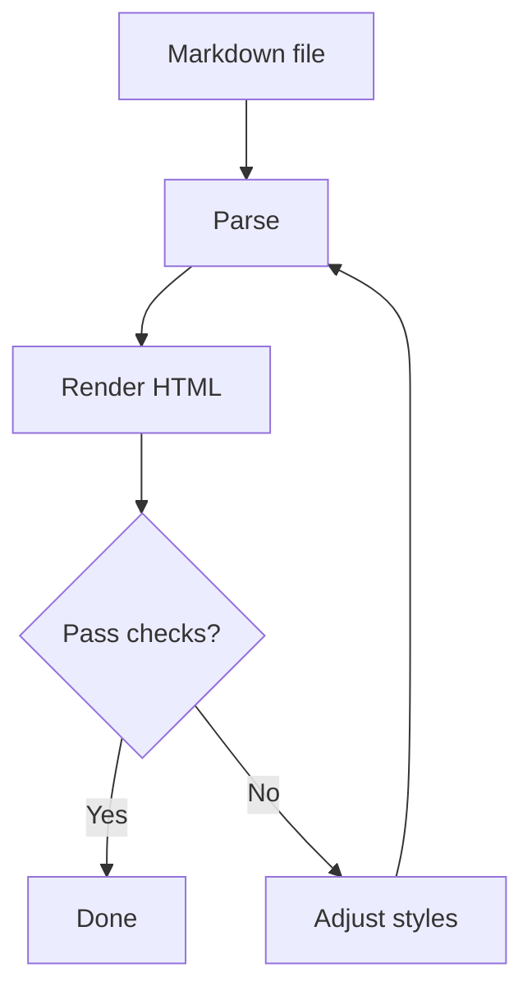

# Hello, World!

> This page demonstrates the rendering output of `vue-demarque`.

## Basic Text

Besides plain text, Markdown also supports **bold**, *italic*, ***bold italic***, ~~strikethrough~~, `inline code`, and extended syntax such as $E=mc^2$.

### Heading Levels

#### Level 4 Heading

##### Level 5 Heading

###### Level 6 Heading

## Lists

### Unordered List

- Apple
- Banana
- Orange
  - Blood orange
  - Navel orange
- Pear

### Ordered List

1. Install dependencies
2. Start the development server
3. Open the browser
4. Check the rendering result

### Task List

- [x] Support headings
- [x] Support lists
- [x] Support tables
- [ ] Support Mermaid diagrams
- [ ] Support custom containers

### Definition List

Markdown
: A lightweight markup language.

Renderer
: A program that converts Markdown text into HTML or other structures.

## Code

Inline code example: `const message = 'hello markdown'`.

```ts
type User = {
  id: number
  name: string
  roles: string[]
}

const user: User = {
  id: 1,
  name: 'Ada',
  roles: ['admin', 'editor'],
}

console.log(`Hello, ${user.name}`)
```

```bash
pnpm install
pnpm dev
pnpm test
```

```json
{
  "name": "vue-demarque",
  "private": true,
  "features": ["markdown", "vue", "syntax-highlight"]
}
```

## Tables

| Feature | Status | Notes |
| --- | :---: | ---: |
| Headings | Done | 6 levels |
| Lists | Done | Nested, tasks |
| Tables | Done | Alignment test |
| Code blocks | Done | Multiple languages |

## Blockquotes and Admonitions

> This is a top-level blockquote.
>
> > This is a nested blockquote.
>
> Blockquotes can also contain **bold text**, `code`, and lists:
>
> - First item
> - Second item

> [!NOTE]
> This is a Note admonition, commonly used for additional information.

> [!TIP]
> This is a Tip admonition, commonly used for recommended practices.

> [!WARNING]
> This is a Warning admonition, commonly used to highlight risks.

## Links, Images, and Footnotes

[Visit GitHub](https://github.com)

Autolink: https://example.com

Email link: hello@example.com


Here is a footnote reference.[^note]

[^note]: This is the footnote content, which can be placed at the bottom of the document.

## Horizontal Rules

---

***


## Mixed HTML

<details>
  <summary>Click to expand more content</summary>

This is Markdown content inside the collapsible area.

- It can contain lists
- It can contain `code`
- It can contain links: [Example](https://example.com)

</details>

<kbd>⌘</kbd> + <kbd>K</kbd>

<mark>This is a piece of text highlighted with the HTML mark tag.</mark>

## Math

Inline formula: $a^2 + b^2 = c^2$

Block formula:

$$
\sum_{i=1}^{n} i = \frac{n(n + 1)}{2}
$$

## Mermaid



## Complex Nesting

1. First level
   - Second-level unordered item
     1. Third-level ordered item
     2. Third-level ordered item with `inline code`
   - Second-level unordered item with a link: [Vue](https://vuejs.org)
2. Back to the first level

## Escaped Characters

\*This is not italic\*

\# This is not a heading

\[This is not a link\]\(https://example.com)

## End

The final paragraph is used to confirm the spacing behavior of a plain paragraph at the end of the document.
